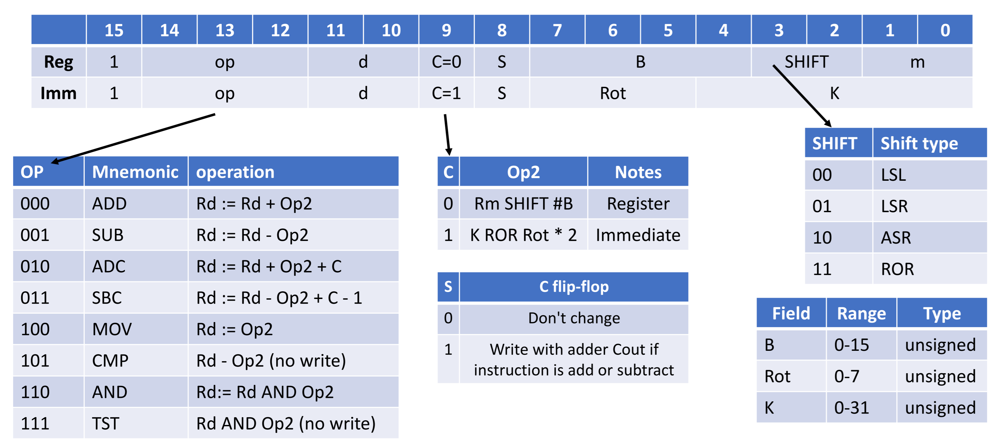
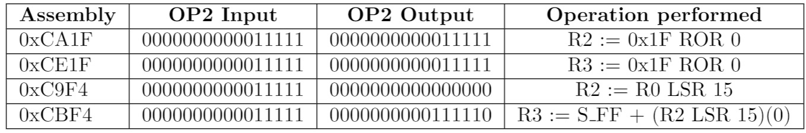

# Central Processing Unit

This repository is the enhanced implementation of the MU0-ARM CPU that is optimised to solve commonly occurring computing problems. It has been built on MU0-ARM architecture from the DECA labs which was improved by adding the serial communication, floating point arithmetic and dual core CPU.

## Requirements

- [ISSIE](https://github.com/tomcl/issie) - an application for digital circuit design and simulation.
- [Node.JS](https://nodejs.org/en/) - a JavaScript runtime built on Chrome's V8 JavaScript engine.
- [Yarn](https://yarnpkg.com/) - package manager for JavaScript libraries.

## Setup

To setup the project just clone in from the GitLab and then run the following command:

```
yarn install
```

This command installs all required dependencies. These dependecies are stored in the `package.json` file. They are used to setup the Git pre-commit hook that formats `.dgm` files before each commit.

## Git workflow

When starting to work on a particular task, move the task in **Board** from the **Open** to **Doing**. Then there is a need to make sure that the local `master` branch is most up to date. To check this make sure that you are using the `master` branch. Before performing any checkout make sure that ISSIE is closed to prevent some conflicts that could be caused by ISSIE's autosaving feature. To checkout, the `master` open Git bash in the project folder and enter `git checkout master`. After checking out `master` download the latest version from the origin using `git pull`. The next step is to create a new branch satisfying the naming convention described in [Branch naming](#branch-naming). Then implement the task as described in the task assignment. When committing new changes make sure that you follow the commit message convention described in [Commit message](#commit-message). After finishing the task, there is a need to push your changes to the origin. This can be done using the command `git push --set-upstream origin [name of the branch]`. The next step is to merge your changes to the `master` on GitLab. To merge the new branch into the `master` create a new merge request in **Merge request** section by clicking on the button **Create merge request** in the notification message with your branch name. Assign the merge request to yourself, remove the **Doing** label from the task, and if there are no conflicts, you will be able to merge your branch into the `master`. Wait until the **Merge** button turns to green and merge your changes to `master`.

### Merge-conflicts

It may happen that someone else has already pushed some changes to `master` after you have created your branch and maybe they changed the same file as you did. This causes a conflict that will prevent you from merging your branch into `master`. To prevent data loss there is a need to accept changes from another person and once again apply your changes because you know what you have changed. You will have to merge `master` from `origin` to your local branch and apply your changes. Before merging make sure that there are no unversioned changes on your current local branch. If there are, remove them or commit them. Then enter the following commands to the Git bash:

- `git checkout master` - checks out the local `master` branch
- `git pull` - pulls the latest version from the origin to master
- `git checkout [your-feature-branch-that-you-want-to-merge]` - checkout your local feature branch
- `git merge --strategy-option theirs master` - merges up to date changes from master. This means that your conflicting changes will be overwritten with changes from `master`. Now you have to implement your changes to the conflicting files once again and make sure that your newly implemented functionality works. Then commit new changes and push them to origin. In case there were no changes in master you should be able to merge your merge request.

## Git pre-commit hook

Git pre-commit hook was setup using the [husky](https://github.com/typicode/husky) library with [lint-staged](https://github.com/okonet/lint-staged) and the [Prettier](https://prettier.io/). The Prettier is configured to format `.dgm` files as pure `JSON` files. Only the files that are in the root directory of the project are formatted. `.dgm` files in the `backup` directory are not formatted.

There is a known issue that prevents from pre-commit hook to run. This issue occurs when some files are staged and then changed on the file system once again without adding them to the stage. This causes the `lint-staged` library to run into problems because it takes files into the stage back on the file system which causes a conflict with edited files. Therefore before committing there is a need to always stage all `.dgm` files.

## Git conventions

### Commit message

Commit messages should follow [Convetional commits](https://www.conventionalcommits.org) specification:

```
<type>[optional scope]: <description> #<task-id>
```

Example:

```
feat(fpu): implement the add operation #3
```

### Branch naming

Branche names should follow the following namimg convetion:

```
{task-id}-{short-task-description}
```

Example:

```
3-prettier
```

## CPU documentation

### Instruction set

| Instruction     | Op code |
| --------------- | ------- |
| Load/Store      | 0000    |
| FPU             | 0001    |
| JLO             | 0010    |
| JLS             | 0011    |
| JMP N           | 0100    |
| JMI N           | 0101    |
| JEQ N           | 0110    |
| STP             | 0111    |
| Data processing | 1000    |
| Data processing | 1001    |
| Data processing | 1010    |
| Data processing | 1011    |
| Data processing | 1100    |
| Data processing | 1101    |
| Data processing | 1110    |
| Data processing | 1111    |

### JLO and JLS

These two instructions were implemented as a part of the challenge. The `JLS` instruction replaces combination of `JMI` and `JEQ` from the old MU0-ARM CPU. The instructions are described by the following table:

| Instruction | Opcode | Condition      | Meaning          |
| ----------- | ------ | -------------- | ---------------- |
| JLO         | 0010   | C = 0          | Jump if Rd < Rm  |
| JLS         | 0011   | C = 0 or Z = 1 | Jump if Rd <= Rm |

- `C` - carry from the previous ALU operation
- `Z` - result of the previous ALU operations was 0

### Data processing instructions



### LoadStore instructions


### FPU instruction

| Opcode \[4 bits\] | D \[2 bits\] | Operation \[2 bits\] | 6 bits remaining | M \[2 bits\] |
| ----------------- | ------------ | -------------------- | ---------------- | ------------ |

- Opcode \[4 bits\] = 0001
- D \[2 bits\] = address of the destination register
- Operation \[2 bits\] = used for selecting the operation
  - 0b00 - Addition
  - 0b01 - Subtraction
  - 0b10 - Multiplication
- 6 bits remaining - will be needed for the 32 bit operations and rounding method selection
- M \[2 bits\] = address of the second operand register

### MOVS instruction

The MOVS instruction is used to perform 32 bit operations using the OP2 block. The example program that uses the MOVS instruction can be seen in the following figure. The program firstly uses immediate instructions that use values to the registers. Then it uses newly developed MOVS instruction to perform multi-word LSR shifts. Firstly, MOVS instruction is called on the value of the R2 register which is considered as a upper-word for the SHIFT. Then the instruction MOV with bit S=0 is called. This instruction uses the output of the flip flops that are in each shift block. These flip flops store values that would be otherwise discarted by the previous operation.




### Pipelining

Pipelining on the Harvard architecture - advantage - it is easier to pipeline the CPU because in every cycle the instruction can be fetched.
Pipelining is implemented by having 2 registers that store instruction that should be executed in the EXEC1 cycle - IR1 and instruction that should be executed in the EXEC2 cycle - IR2. Because there is a need to insert stalls between instructions to pipeline, two output flags IR1_VALID and IR2_VALID were added to show which of the two instructions is valid. The IRBlock has to be able to detect following hazards:

- control hazards - occur when any jump instruction is fetched
- structural hazards - occur when two instructions try to access the same hardware at the same time
- data dependency hazards - occur when the result of the instruction IR2 needs to be used by IR1
  .

#### Hazard detection logic

Whole hazard detection logic was implementing by having combinational circuit hazard detector. This block does not store any state and by decoding given instructions, determines whether any hazard might occur. It has 4 outputs - `REG_HAZARD`, `RAM_HAZARD`, `CONTROL_HAZARD` and `STALL`. The `STALL` output from the hazard detector always does not determine whether the stall cycle should be inserted or not because in the case the store occurred in the previous cycle, both IR1 and IR2 will be the same and therefore the pipeline would be stalled forever. To overcome this problem, state circuits were added to the IRBlock that help to determine if the pipeline should be stalled. The output of the hazard detector is anded with the INITIAL_FETCH_OCCURRED wire label to ensure, that the CPU will not be stalled in the first clock cycle. The second and gate to which the STALL output is connected is to prevent stalling the instruction forever because of the control hazard that occurred in the previous cycle. The third and gate with input `NOT(STALL_IN_PREV_CYCLE . RAM_HAZARD_PREV_CYCLE)` is connected to the output of the hazard detector to make sure that the pipeline is not stalled forever because of the RAM hazard that occurred in the previous cycle. The fourth AND gate is inserted to make sure that 3 stall cycles are not inserted to the pipeline. The `MUX4` was added for the case when both register and RAM hazards occur during one cycle. In this case, the output of the hazard detector is ignored. If both RAM and register hazards occurred during the same cycle, firstly the stall for the register cycle will be inserted and the stall for the RAM hazard. Last AND gate was added to make sure that the CPU will not be stalled when the stop instruction was loaded.

#### Validity of instructions

During the design proccess, it was observed that the stall cycle will not ever be inserted between the E1 and E2. The logic for `IR1_VALID` was determined the way described in the following text. The instruction 1 will be valid if following logic gates produce 1.

- G17 - the STALL was not inserted in the previous valid or if RAM hazard did not occur in the previous cycle. In the following picture the IR1 is not valid in the cycle 2 because of the situation that occurred before the instruction that is handled by this logic gate.
- G34 - RAM hazard did not occur in the cycle that was before the previous cycle and the hazard detector was not ignored and both STALL due to RAM and register hazards were inserted into the pipeline. Example in which this gate makes output 0 instead of 1 is in the following picture. The IR1 is not valid in the cycle 6.
- G21 - the IR1 is not valid if the register hazard was detected by the hazard detector. In the following picture, IR1 is not valid because of this condition in the cycle 10.
- G20 - the IR1 is valid when if the register hazard was detected in the previous cycle. In the following picture, IR1 is valid because of this condition in the cycle 11.
- G27 - the IR1 is valid when the stop instruction was decoded.
- G3 - the IR1 is not valid if the initial fetch did not occur.


## Authors

- Michal Palič ([michal.palic20@imperial.ac.uk](mailto:michal.palic20@imperial.ac.uk))
- Chenghong Ren ([chenghong.ren20@imperial.ac.uk](mailto:chenghong.ren20@imperial.ac.uk))
- Václav Pavlíček ([vaclav.pavlicek20@imperial.ac.uk](mailto:vaclav.pavlicek20@imperial.ac.uk))
